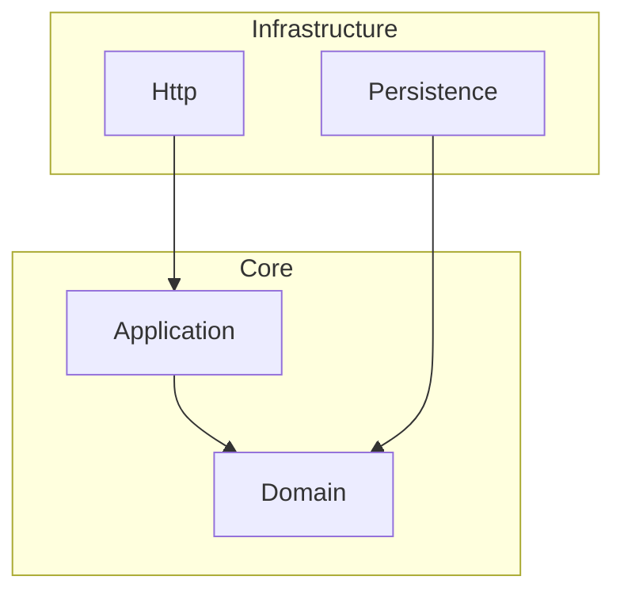

# 第 7 章：CI/CD 集成指南

> 🟡 适合阶段：熟悉
> 
> 阅读时间：约 12 分钟

---

## 7.1 为什么要集成 CI/CD？

```
                没有 CI/CD 集成                    有 CI/CD 集成

开发者提交代码 ──▶ 人工 Code Review ──▶ 合并     开发者提交代码 ──▶ CI 自动检查 ──▶ Review ──▶ 合并
                  (容易遗漏架构问题)                              (违规立即报错)
                                                                     │
                                                               ┌─────┴──────┐
                                                               │ 0 violations│ ──▶ ✅ 可以合并
                                                               │ N violations│ ──▶ ❌ 必须修复
                                                               └────────────┘
```

> **核心理念**：架构检查应该像单元测试一样，每次提交都自动运行。

## 7.2 GitHub Actions 集成

### 基础配置

```yaml
# .github/workflows/deptrac.yml
name: Architecture Check

on:
  push:
    branches: [ main, develop ]
  pull_request:
    branches: [ main, develop ]

jobs:
  deptrac:
    runs-on: ubuntu-latest
    steps:
      - uses: actions/checkout@v4

      - name: Setup PHP
        uses: shivammathur/setup-php@v2
        with:
          php-version: '8.2'
          tools: composer

      - name: Install dependencies
        run: composer install --prefer-dist --no-progress

      - name: Run Deptrac
        run: vendor/bin/deptrac --no-progress
```

### GitHub Actions 原生支持

Deptrac 内置了 GitHub Actions 格式化器！当在 GitHub Actions 环境中运行时，它会自动检测并启用 `github-actions` 格式化器，直接在 PR 的文件差异中显示注解：

```
::error file=src/Controller/UserController.php,line=12::UserController must not depend on UserRepository (Controller on Repository)
```

效果：在 PR 页面的代码行旁边直接显示红色错误标记 🔴。

### 带缓存的优化配置

```yaml
# .github/workflows/deptrac.yml
name: Architecture Check

on:
  push:
    branches: [ main ]
  pull_request:

jobs:
  deptrac:
    runs-on: ubuntu-latest
    steps:
      - uses: actions/checkout@v4

      - name: Setup PHP
        uses: shivammathur/setup-php@v2
        with:
          php-version: '8.2'

      - name: Cache Composer dependencies
        uses: actions/cache@v4
        with:
          path: vendor
          key: ${{ runner.os }}-composer-${{ hashFiles('**/composer.lock') }}

      - name: Cache Deptrac
        uses: actions/cache@v4
        with:
          path: .deptrac.cache
          key: ${{ runner.os }}-deptrac-${{ github.sha }}
          restore-keys: ${{ runner.os }}-deptrac-

      - name: Install dependencies
        run: composer install --prefer-dist --no-progress --no-suggest

      - name: Run Deptrac
        run: vendor/bin/deptrac --no-progress --report-uncovered --fail-on-uncovered
```

> 💡 **`--fail-on-uncovered`** 会让未覆盖依赖也导致 CI 失败。推荐在成熟项目中启用。

## 7.3 GitLab CI 集成

### 使用 Codeclimate 格式化器

```yaml
# .gitlab-ci.yml
deptrac:
  stage: test
  image: php:8.2-cli
  before_script:
    - composer install --prefer-dist --no-progress
  script:
    - vendor/bin/deptrac --formatter=codeclimate --output=gl-code-quality-report.json --no-progress
  artifacts:
    reports:
      codequality: gl-code-quality-report.json
    when: always
  allow_failure: false
```

### Codeclimate 严重级别配置

```yaml
# deptrac.yaml
deptrac:
  formatters:
    codeclimate:
      severity:
        failure: major         # 违规报告为 major
        skipped: minor         # 跳过的报告为 minor
        uncovered: info        # 未覆盖的报告为 info
```

## 7.4 所有输出格式化器

| 格式化器 | 命令参数 | 适用场景 | 输出 |
|---------|---------|---------|------|
| **table** | `--formatter=table` | 本地开发（默认） | 终端表格 |
| **console** | `--formatter=console` | 简洁的违规列表 | 文本 |
| **github-actions** | 自动检测 | GitHub Actions CI | 行内注解 |
| **codeclimate** | `--formatter=codeclimate` | GitLab CI | JSON |
| **json** | `--formatter=json` | 自定义处理 | JSON |
| **junit** | `--formatter=junit` | Jenkins / 通用 CI | XML |
| **baseline** | `--formatter=baseline` | 生成 baseline 文件 | YAML |
| **graphviz-image** | `--formatter=graphviz-image` | 架构图（图片） | PNG/SVG |
| **graphviz-dot** | `--formatter=graphviz-dot` | 架构图（DOT） | DOT 文件 |
| **graphviz-html** | `--formatter=graphviz-html` | 架构图（网页） | HTML |
| **graphviz-display** | `--formatter=graphviz-display` | 直接打开架构图 | 系统图片查看器 |
| **mermaidjs** | `--formatter=mermaidjs` | Mermaid.js 图表 | Mermaid 语法 |

### 输出到文件

```bash
# JSON 格式输出到文件
vendor/bin/deptrac --formatter=json --output=deptrac-report.json

# JUnit XML 报告
vendor/bin/deptrac --formatter=junit --output=junit-report.xml

# 架构图保存为 PNG
vendor/bin/deptrac --formatter=graphviz-image --output=architecture.png

# Mermaid.js 图表
vendor/bin/deptrac --formatter=mermaidjs --output=architecture.mmd
```

## 7.5 Graphviz 可视化配置

### 分组显示

```yaml
deptrac:
  formatters:
    graphviz:
      groups:
        Core:                      # 分组名
          - Domain
          - Application
        Infrastructure:
          - Persistence
          - Http
          - Messaging
      hidden_layers:
        - SharedKernel             # 不在图中显示
      pointToGroups: true          # 连线指向组而非节点
```

### 效果示意

```
┌──── Core ──────────────────┐
│ ┌────────┐  ┌────────────┐ │
│ │ Domain │  │Application │ │
│ └────────┘  └────────────┘ │
└────────────────────────────┘
              ▲
              │
┌──── Infrastructure ────────┐
│ ┌───────┐ ┌────┐ ┌──────┐ │
│ │Persist│ │Http│ │ Msg  │ │
│ └───────┘ └────┘ └──────┘ │
└────────────────────────────┘
```

## 7.6 Mermaid.js 可视化配置

Mermaid.js 的优势：不需要安装 Graphviz，可以直接嵌入 Markdown！

```yaml
deptrac:
  formatters:
    mermaidjs:
      direction: TD              # TD=上到下, LR=左到右, BT=下到上, RL=右到左
      groups:
        Core:
          - Domain
          - Application
      hidden_layers: []
```

生成的 Mermaid 图表可以直接放在 GitHub README 中：

````markdown

````

## 7.7 Baseline 工作流（渐进式修复）

对于遗留项目，最佳实践是使用 Baseline 机制：

```
步骤 1: 生成 baseline（记录所有现有违规）
        │
        ▼
步骤 2: 将 baseline 导入配置
        │
        ▼
步骤 3: CI 只检查新违规（baseline 中的不报错）
        │
        ▼
步骤 4: 逐步修复 baseline 中的违规
        │
        ▼
步骤 5: 重新生成 baseline（越来越小）
        │
        ▼
步骤 6: 最终目标：baseline 为空 🎉
```

### 操作步骤

```bash
# 1. 生成 baseline
vendor/bin/deptrac --formatter=baseline --output=deptrac.baseline.yaml

# 2. 在 deptrac.yaml 中导入
```

```yaml
# deptrac.yaml
imports:
  - deptrac.baseline.yaml

deptrac:
  paths:
    - ./src
  # ... 其他配置
```

```bash
# 3. 再次运行，所有 baseline 中的违规被跳过
vendor/bin/deptrac

# 4. CI 中使用 --report-skipped 报告跳过的违规数
vendor/bin/deptrac --report-skipped
```

### 生成的 baseline 文件示例

```yaml
# deptrac.baseline.yaml（自动生成，不要手动编辑）
deptrac:
  skip_violations:
    App\Controller\LegacyController:
      - App\Repository\UserRepository
      - App\Repository\OrderRepository
    App\Service\ReportService:
      - App\Controller\DashboardController
```

## 7.8 多格式化器组合

你可以同时运行多个格式化器：

```bash
# 终端显示 + 生成 JSON 报告 + 生成架构图
vendor/bin/deptrac \
  --formatter=table \
  --formatter=json --output=report.json
```

> ⚠️ **注意**：每次命令只能指定一个 `--output`，它对应最后一个 `--formatter`。
> 如果需要多个文件输出，运行多次命令。

## 7.9 CI 集成最佳实践

### 1. 必须设置的 CI 选项

```bash
vendor/bin/deptrac \
  --no-progress \              # CI 中不需要进度条
  --report-uncovered \         # 报告未覆盖的依赖
  --fail-on-uncovered          # 未覆盖依赖导致失败（严格模式）
```

### 2. 使用退出码判断结果

| 退出码 | 含义 |
|--------|------|
| `0` | 无违规 ✅ |
| `1` | 存在违规 ❌ |

### 3. CI 流水线位置建议

```
┌─────────┐    ┌──────────┐    ┌─────────┐    ┌────────┐    ┌──────┐
│ Install │───▶│ Lint/CS  │───▶│ Deptrac │───▶│ Tests  │───▶│Build │
│  Deps   │    │ 代码风格  │    │ 架构检查 │    │ 单元测试│    │ 构建 │
└─────────┘    └──────────┘    └─────────┘    └────────┘    └──────┘
                                    │
                               失败则停止
                              (快速反馈)
```

> 💡 **把 Deptrac 放在测试之前**：架构检查比运行测试更快，如果架构有问题，
> 没必要浪费时间跑测试。

### 4. PR 的变更文件检查（实验性）

```bash
# 检查变更的文件影响了哪些层
vendor/bin/deptrac changed-files src/Controller/UserController.php

# 加上 --with-dependencies 查看连锁影响
vendor/bin/deptrac changed-files --with-dependencies src/Controller/UserController.php
```

## 7.10 本章小结

| 学到了 | 要点 |
|--------|------|
| GitHub Actions | 自动检测并在 PR 中标注违规 |
| GitLab CI | 使用 codeclimate 格式化器集成代码质量 |
| 格式化器 | 12 种输出格式，适配不同场景 |
| Graphviz | 生成架构可视化图（需安装 Graphviz） |
| Mermaid.js | 无需安装额外工具，可嵌入 Markdown |
| Baseline | 渐进式修复遗留项目的最佳实践 |
| CI 最佳实践 | `--no-progress --report-uncovered --fail-on-uncovered` |

---

**下一章**：[第 8 章：调试与排错指南](./08-debugging.md) — 用调试命令快速定位问题！
